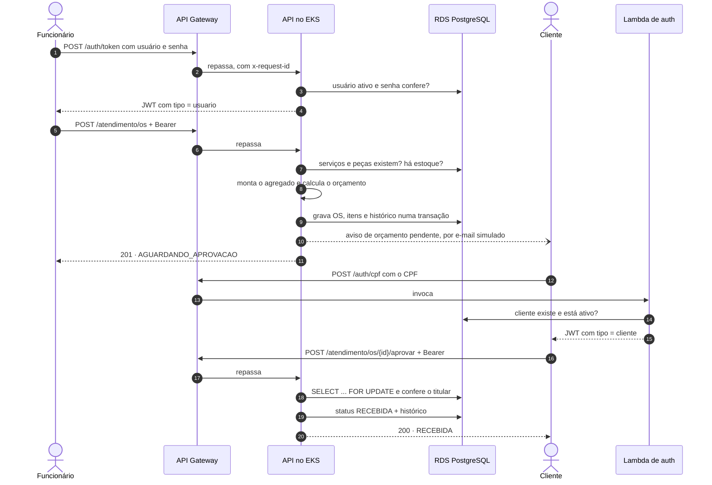

# tech-challenge-app — API da Oficina Mecânica

API de gestão de Ordens de Serviço, executando em Kubernetes (Amazon EKS).
É a **aplicação principal** do Tech Challenge — Fase 03.

> Pós-Tech Software Architecture · FIAP

| | |
|---|---|
| **Papel** | Regra de negócio e API REST de toda a operação da oficina |
| **Runtime** | Amazon EKS · namespace `oficina` |
| **Exposição** | Somente via API Gateway → VPC Link → NLB interno |
| **Autenticação** | Valida o JWT emitido pela Lambda (`tech-challenge-auth-lambda`) |
| **Banco** | Amazon RDS PostgreSQL (`tech-challenge-infra-db`) |
| **Observabilidade** | New Relic — APM, logs JSON correlacionados e métricas do cluster |

---

## Os quatro repositórios

Este é um de quatro repositórios independentes. Cada um tem seu próprio ciclo de vida e pipeline:

| Repositório | Responsabilidade |
|---|---|
| **tech-challenge-app** ← você está aqui | API em Kubernetes: domínio, casos de uso, manifestos e deploy |
| `tech-challenge-auth-lambda` | Function serverless que autentica por CPF e emite o JWT |
| `tech-challenge-infra-k8s` | Terraform: cluster EKS, API Gateway, ECR, role OIDC e New Relic |
| `tech-challenge-infra-db` | Terraform: **VPC**, RDS PostgreSQL, backup e Secrets Manager |

**Dependência de ordem:** `infra-db` → `infra-k8s` → esta aplicação. O `infra-db` é
dono da rede (a VPC sobrevive ao cluster, que é efêmero) e publica os identificadores
no SSM Parameter Store; o `infra-k8s` os consome e cria o cluster, o ECR e a role OIDC
que este pipeline assume.

---

## Documentação

| Documento | Onde está |
|---|---|
| Diagrama de componentes | `tech-challenge-infra-k8s` · README, seção *Arquitetura* |
| Sequência da autenticação por CPF | `tech-challenge-infra-k8s` · README, *Fluxo de uma requisição autenticada* |
| Sequência da abertura de ordem de serviço | `tech-challenge-app` · README, *Abertura de uma ordem de serviço* |
| Modelo de dados: ER, relacionamentos e ajustes | `tech-challenge-app` · `docs/modelo-de-dados.md` |
| RFC-001 · Escolha da nuvem | `tech-challenge-infra-k8s` · `docs/rfc/RFC-001-nuvem.md` |
| RFC-002 · Escolha do banco de dados | `tech-challenge-infra-db` · `docs/rfc/RFC-002-banco-de-dados.md` |
| RFC-003 · Estratégia de autenticação | `tech-challenge-auth-lambda` · `docs/rfc/RFC-003-autenticacao.md` |
| ADR-001 a 004 · rede e banco | `tech-challenge-infra-db` · README |
| ADR-005 a 008, 013 e 014 · cluster, CI e observabilidade | `tech-challenge-infra-k8s` · README |
| ADR-009 a 012 · autenticação | `tech-challenge-auth-lambda` · README |
| ADR-015 e 016 · padrão de comunicação e notificação | `tech-challenge-app` · README |
| Swagger | `<url_api>/docs` na AWS · `http://localhost:8000/docs` localmente |
| Coleção Postman | `tech-challenge-app` · `postman/oficina.postman_collection.json` |
| Ambientes e deploy ativo | só produção, com a dispensa de homologação registrada no README do `tech-challenge-app`; o ambiente AWS é efêmero (ADR-013), e a URL da API sai em `make output`, no `tech-challenge-infra-k8s`, durante uma sessão |


---

## Arquitetura

Hexagonal (Ports & Adapters), com o domínio livre de framework — `import app.domain.entities.os`
não carrega SQLAlchemy nem FastAPI.

```
  ADAPTERS INBOUND          APPLICATION              ADAPTERS OUTBOUND
  ────────────────          ───────────              ─────────────────
  atendimento_routes        CriarOS                  OSRepositoryAdapter
  cadastro_routes           ListarOS                 ClienteRepositoryAdapter
  catalogo_routes    ──►    AtualizarStatus    ──►   CatalogoRepositoryAdapter
  estoque_routes            AprovarOS / RejeitarOS   EstoqueRepositoryAdapter
  auth_routes               ProcessarWebhookEmail    EmailSimuladoAdapter
  webhook_routes            Gerenciar{Catalogo,          │
  middleware (correlação)     Estoque,Clientes,          │ implementa
                              Veiculos}                  ▼
                                  │                  ┌─────────────────────┐
                                  └────────────────► │      DOMAIN         │
                                                     │  OrdemDeServico     │
                                                     │  Cliente · Veiculo  │
                                                     │  Peca · Servico     │
                                                     │  CpfCnpj · Placa    │
                                                     │  Ports (Protocol)   │
                                                     └─────────────────────┘
                                                     INFRASTRUCTURE
                                                     orm_mapping · config
                                                     security · logging
```

**Regra de dependência:** as setas apontam sempre para dentro. O mapeamento
objeto-relacional é *imperativo* (`registry.map_imperatively`), então as entidades
não sabem que existe um banco.

### Ciclo de vida da Ordem de Serviço

```
AGUARDANDO_APROVACAO ──► RECEBIDA ──► EM_DIAGNOSTICO ──► EM_EXECUCAO ──► FINALIZADA ──► ENTREGUE
         │                                    │                 │              │
         ├──► NEGADA                          └──► volta para   │              └─ finalizado_em
         └──► ABANDONADA                        AGUARDANDO      └─ baixa de estoque + iniciado_em
```

Transições fora deste mapa são recusadas pelo próprio agregado, com `BusinessRuleException`.
Cada entrada em um status fica registrada em `historico_status_os`; daí saem o histórico
devolvido em `GET /atendimento/os/{id}` e o tempo médio por status das métricas. O modelo
completo, com diagrama ER, está em [docs/modelo-de-dados.md](docs/modelo-de-dados.md).

### Abertura de uma ordem de serviço



Daí em diante o funcionário move a OS pelos status até a entrega; cada mudança grava o histórico
e emite o evento `os_status` que alimenta o dashboard.

O aviso ao cliente passa pela porta `EmailNotificacaoPort`, hoje implementada por um adapter que
registra o e-mail em log (ADR-016).

---

## Decisões arquiteturais

### ADR-015 · Comunicação síncrona por REST, com o API Gateway como porta única

**Contexto.** Dois serviços atendem requisições, a API no EKS e a Lambda de autenticação, e quatro
repositórios precisam trocar identificadores de infraestrutura.

**Decisão.**
- Cliente e funcionário falam com a solução só por HTTP, através do API Gateway: `POST /auth/cpf`
  vai para a Lambda, e todo o resto segue por VPC Link e NLB para a API.
- Os serviços não chamam um ao outro. A Lambda emite o JWT e a API o valida com a mesma chave; o que
  os liga é o contrato do token, com o claim `tipo`, e não uma chamada de rede.
- Entre repositórios, a troca acontece só no provisionamento, pelo contrato no SSM Parameter Store
  (ADR-003, no `tech-challenge-infra-db`).
- Não há mensageria. Eventos de negócio, como `os_status`, saem como log estruturado para a
  observabilidade, e não como mensagens consumidas por outro serviço.

**Motivo.** Todo fluxo do desafio é uma requisição que espera resposta: autenticar, abrir a OS,
aprovar o orçamento, mudar o status. Uma fila acrescentaria entrega assíncrona, reprocessamento e mais
um serviço para operar, sem nenhum consumidor que dependa disso.

**Consequências.**
- Latência e erro ficam visíveis de ponta a ponta: o `requestId` do gateway vira o `correlation_id`
  da API.
- Uma falha do banco aparece na hora para quem chamou, como 503 na Lambda ou 5xx na API, sem
  mensagens acumulando.
- Quando surgir um consumidor assíncrono, como a notificação real (ADR-016), o evento já existe e
  passa a ser publicado num tópico.

---

### ADR-016 · Notificação por porta, com envio simulado nesta fase

**Contexto.** O cliente precisa saber que há um orçamento aguardando aprovação. O desafio sugere
soluções serverless para notificações, mas nenhum requisito define canal, provedor ou conteúdo.

**Decisão.** A abertura da OS chama a porta `EmailNotificacaoPort`. O adapter atual,
`EmailSimuladoAdapter`, registra o e-mail em log estruturado (`oficina.notificacoes`). A resposta do
cliente volta pelas rotas autenticadas por CPF ou pelo webhook `POST /webhooks/email`.

**Motivo.** Um provedor real exige identidade de envio verificada, já que o SES em sandbox só envia
para endereços verificados, ou confirmação manual de assinatura, no caso de e-mail pelo SNS. Os dois
quebrariam a reprodução do ambiente em outra conta sem passos manuais.

**Caminho serverless.** Um adapter que publica o evento num tópico SNS, assinado por uma Lambda que
envia pelo SES. Domínio e casos de uso não mudam; só a composição na rota de abertura da OS.

**Consequência.** Nesta entrega, a notificação é demonstrada pelo log, e não por uma caixa de entrada.

---

## Como rodar localmente

Não precisa de AWS nem de conta no New Relic.

```bash
make setup     # cria o .env a partir do .env.example
make up        # sobe API + PostgreSQL com hot-reload
```

| Recurso | URL |
|---|---|
| Swagger | http://localhost:8000/docs |
| ReDoc | http://localhost:8000/redoc |
| OpenAPI | http://localhost:8000/openapi.json |
| Liveness | http://localhost:8000/health |
| Readiness | http://localhost:8000/health/ready |

Primeiro acesso: `POST /auth/token` com `admin` / `admin123` (o usuário é semeado no boot).

```bash
make test         # suíte completa em Python 3.12; cria o .venv na primeira vez
make test-docker  # a mesma suíte dentro do container, sem depender do Python da máquina
make cov          # com relatório de cobertura
make down         # derruba e limpa os volumes
```

---

## Observabilidade

### Logs estruturados com correlação

Toda requisição recebe um `correlation_id` — herdado do cabeçalho `x-request-id`,
`x-correlation-id` ou `x-amzn-trace-id` quando vem do API Gateway, ou gerado aqui.
Ele acompanha **todas** as linhas de log da requisição, inclusive dentro dos casos
de uso, via `ContextVar`. E volta ao cliente no cabeçalho `x-request-id` e no corpo
de qualquer erro — então um problema relatado pelo usuário é rastreável direto no New Relic.

```json
{"timestamp":"2026-09-07T18:42:10.512+00:00","level":"INFO","logger":"oficina.http",
 "message":"POST /atendimento/os 201","correlation_id":"9f2c...","http_method":"POST",
 "http_path":"/atendimento/os","http_status":201,"duracao_ms":48.31}
```

`LOG_FORMAT=json` em ambiente remoto, `console` em desenvolvimento.

### Eventos de negócio

Cada mudança de status da OS gera um log com `evento=os_status` e o tempo que ela passou no
status anterior; a abertura vem sem `status_anterior`. São a base dos dashboards de
volume diário e de tempo médio por status.

```json
{"level":"INFO","logger":"oficina.os","message":"OS 3fa8... entrou em EM_EXECUCAO",
 "evento":"os_status","status_anterior":"EM_DIAGNOSTICO","status_novo":"EM_EXECUCAO",
 "segundos_no_status_anterior":1843.2,"correlation_id":"9f2c..."}
```

### Healthchecks

| Rota | Sonda | O que verifica |
|---|---|---|
| `/health` | liveness, startup | Só que o processo responde — **sem tocar no banco** |
| `/health/ready` | readiness | Que o banco responde (`SELECT 1`) |

A separação é deliberada: se a liveness dependesse do banco, uma indisponibilidade do RDS
faria o Kubernetes matar pods saudáveis em cascata.

### New Relic

O agente sobe apenas quando `NEW_RELIC_LICENSE_KEY` está definida — a mesma imagem roda
igual em desenvolvimento sem exigir conta. O `entrypoint.sh` decide entre
`newrelic-admin run-program uvicorn` e `uvicorn` puro.

Os logs chegam ao New Relic pelo stdout, coletado pelo `nri-bundle` do `tech-challenge-infra-k8s`.
Por isso o encaminhamento do próprio agente fica desligado no ConfigMap, e cada linha JSON
gravada dentro de uma requisição leva `trace.id` e `span.id`: do log se abre o trace, e vice-versa.

---

## Deploy

> **Montando tudo do zero?** O roteiro completo, com a ordem dos quatro repositórios, está no
> README do `tech-challenge-infra-db`, seção *Do zero numa conta nova*.

### Pipeline

```
 push/PR ──► testes ─────┐
                         ├──► imagem: build + boot contra PostgreSQL
            manifestos ──┘            │
                                      └──► (main, ambiente no ar) ECR ──► EKS ──► smoke test
```

| Evento | `AMBIENTE_ATIVO` | O que roda |
|---|---|---|
| Pull Request, push em `develop` | qualquer | testes, manifestos, build da imagem e boot dela contra PostgreSQL |
| push em `main` ou execução manual | `true` | tudo acima, mais publicação no ECR e deploy no EKS |
| push em `main` ou execução manual | ausente ou `false` | a parte sem AWS; publicação e deploy **pulados**, com o motivo no resumo |

O boot da imagem roda sempre, com ou sem nuvem: o entrypoint real migra um PostgreSQL vazio
e a readiness precisa responder. Dockerfile quebrado ou migration inválida param aqui, antes
de chegar ao cluster.

**Ambiente efêmero.** O ambiente AWS só existe durante as sessões de trabalho (`make up` e
`make down` no `tech-challenge-infra-k8s`), e a variável de repositório `AMBIENTE_ATIVO` diz ao
pipeline em que estado ele está — ver ADR-013 naquele repositório. **Job pulado não é falha**:
é o comportamento esperado com o ambiente desligado. Já uma falha de autenticação com a
variável em `true` fica vermelha e explica no log as causas prováveis.

A `main` é protegida: sem push direto; código só entra por Pull Request, com os checks do CI obrigatórios.

**Ambiente único.** O enunciado pede deploy automático de homologação e produção; na live de
apresentação da fase, a orientação foi que apenas produção é suficiente. Um segundo ambiente
seria o diretório `k8s/overlays/producao` copiado com outro `namespace` — a base é compartilhada.

O pipeline autentica na AWS por **OIDC**, sem chave de acesso estática no GitHub. O Secret do
Kubernetes é montado a cada deploy a partir do AWS Secrets Manager, então nenhum segredo é
versionado neste repositório.

### Secrets e variáveis do repositório

| Configuração no repositório | Tipo | Quem grava |
|---|---|---|
| `AWS_ROLE_ARN` | secret | `make github-segredos`, no `tech-challenge-infra-k8s` |
| `AMBIENTE_ATIVO` | variável | `make up` e `make down`, no `tech-challenge-infra-k8s` |
| `NEW_RELIC_LICENSE_KEY` | secret | `make github-segredos`, se a chave estiver exportada |

### Manifestos

Kustomize com base compartilhada e overlay de produção:

```
k8s/
├── base/          deployment · service · hpa · configmap · pdb
└── overlays/
    └── producao/  namespace oficina · 2 réplicas · HPA até 6
```

```bash
make render      # inspeciona o resultado antes de aplicar
make implantar   # aciona o pipeline de deploy na main, sem precisar de commit
```

O `Secret` não está nos manifestos de propósito: quem o cria é o pipeline. Pelo mesmo motivo
não existe deploy manual paralelo — ele divergiria do caminho que o pipeline garante.

---

## Rotas

Dois tipos de token, ambos no cabeçalho `Authorization: Bearer`:

| Quem | Onde obtém | O que acessa |
|---|---|---|
| Funcionário | `POST /auth/token` nesta API | operação da oficina, conforme o papel |
| Cliente | `POST /auth/cpf` — Lambda do `tech-challenge-auth-lambda` | apenas as próprias ordens de serviço |

Os dois são assinados com a mesma `SECRET_KEY`; é o claim `tipo` do JWT que os separa.
Token de cliente em rota da oficina responde `403`, e vice-versa. A OS de outro cliente
responde `404`, idêntico a uma inexistente — não dá para descobrir ids alheios testando.
No Swagger, cada público tem seu esquema no **Authorize**.

### Autenticação
| Método | Rota | Acesso |
|---|---|---|
| POST | `/auth/token` | pública, com rate limit de 10 req/min por IP em cada processo da API |
| POST · GET | `/auth/usuarios` | ADMIN |
| DELETE | `/auth/usuarios/{id}` | ADMIN |

### Ordens de Serviço
| Método | Rota | Acesso |
|---|---|---|
| POST | `/atendimento/os` | autenticado |
| GET | `/atendimento/os` | autenticado |
| GET | `/atendimento/os/fila` | autenticado |
| GET | `/atendimento/os/metricas/tempo-medio` | ADMIN |
| PATCH | `/atendimento/os/{id}/status` | autenticado |
| GET | `/atendimento/os/{id}` | funcionário, ou cliente dono da OS |
| GET | `/atendimento/os/consulta` | cliente — apenas as próprias OS |
| POST | `/atendimento/os/{id}/aprovar` · `/rejeitar` | cliente titular da OS |

### Cadastro, Catálogo e Estoque
CRUD completo de clientes, veículos, serviços e peças. Escrita em catálogo e estoque exige ADMIN.
Para desativar um cliente, `PATCH /cadastro/clientes/{id}` com `{"ativo": false}`: a Lambda passa a
responder 403 para o CPF dele, e os tokens já emitidos, 401.

### Webhook
| Método | Rota | Acesso |
|---|---|---|
| POST | `/webhooks/email` | token compartilhado, comparado com `hmac.compare_digest` |

Detalhes, schemas e exemplos no Swagger. A jornada completa, do cadastro à entrega, está na coleção
[postman/oficina.postman_collection.json](postman/oficina.postman_collection.json).

---

## Variáveis de ambiente

| Variável | Obrigatória | Padrão | Descrição |
|---|---|---|---|
| `DATABASE_URL` | sim | — | Conexão PostgreSQL |
| `SECRET_KEY` | sim | — | Chave do JWT — **precisa ser idêntica à da Lambda** |
| `ALGORITHM` | não | `HS256` | Algoritmo do JWT |
| `ACCESS_TOKEN_EXPIRE_MINUTES` | não | `60` | Validade do token |
| `ADMIN_USERNAME` / `ADMIN_PASSWORD` | não | `admin` / `admin123` | Usuário semeado no boot |
| `WEBHOOK_SECRET` | não | `webhook-secret-local` | Token do webhook de e-mail |
| `ALLOWED_ORIGINS` | não | `["http://localhost:3000"]` | CORS, lista JSON |
| `LOG_FORMAT` | não | `console` | `json` em ambiente remoto |
| `LOG_LEVEL` | não | `INFO` | Nível do logger raiz |
| `NEW_RELIC_LICENSE_KEY` | não | — | Vazia desliga o agente |
| `NEW_RELIC_APP_NAME` | não | `tech-challenge-oficina` | Nome da aplicação no New Relic |
| `UVICORN_WORKERS` | não | `2` | Workers do uvicorn em produção |

---

## Testes

```bash
make test         # Python 3.12 local
make test-docker  # dentro do container
```

Cobrem caminho feliz, erro, autorização por papel, ciclo completo da OS, concorrência
de estoque, webhook e observabilidade. `tests/test_dominio_puro.py` exercita o agregado
**sem banco e sem HTTP** — é a rede de proteção da regra de dependência: se o domínio
voltar a depender da infraestrutura, quebra ali primeiro.

---

## Stack

Python 3.12 · FastAPI · SQLAlchemy 2.0 (mapeamento imperativo) · Alembic · PostgreSQL 16
· pytest · Docker · Kubernetes (EKS) · Kustomize · GitHub Actions · New Relic
