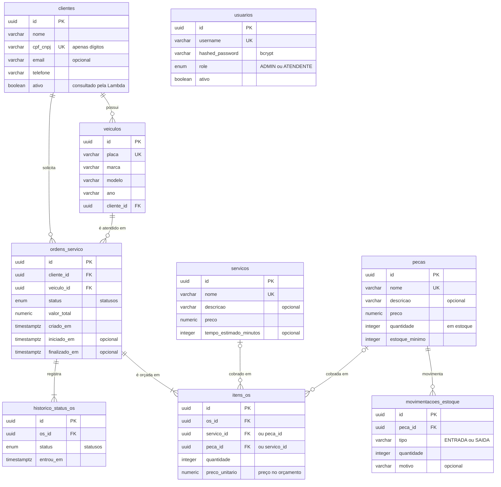

# Modelo de dados

Schema PostgreSQL da oficina, versionado pelo Alembic em `alembic/versions`. A escolha do banco
está justificada na RFC-002, no `tech-challenge-infra-db`.

## Diagrama ER

## Relacionamentos

| Relação | Cardinalidade | O que o modelo garante |
|---|---|---|
| `clientes` → `veiculos` | 1 : N | todo veículo tem dono (`cliente_id NOT NULL`) |
| `clientes` → `ordens_servico` | 1 : N | a OS guarda o cliente diretamente, então "minhas ordens de serviço" não depende do veículo |
| `veiculos` → `ordens_servico` | 1 : N | toda OS é de um veículo cadastrado |
| `ordens_servico` → `itens_os` | 1 : N | item não existe sem OS; a abertura exige ao menos um item |
| `servicos` e `pecas` → `itens_os` | 1 : N | cada item aponta para um serviço ou para uma peça, e `preco_unitario` guarda o preço do momento do orçamento |
| `ordens_servico` → `historico_status_os` | 1 : N | uma linha por entrada em um status, a começar pela abertura |
| `pecas` → `movimentacoes_estoque` | 1 : N | toda entrada e saída de estoque deixa rastro |

`usuarios` não se relaciona com as demais tabelas: guarda os funcionários que operam a API.
Clientes não têm senha e se autenticam pelo CPF (RFC-003, no `tech-challenge-auth-lambda`).

## Decisões de modelagem

- **UUID como chave primária.** Gerado pela aplicação; um id na URL não revela volume nem permite
  adivinhar o próximo registro.
- **`NUMERIC(10,2)` para dinheiro.** Sem erro de arredondamento de ponto flutuante.
- **ENUM nativo para status e papel.** O banco recusa um status inexistente; quem controla as
  transições é o agregado `OrdemDeServico`.
- **Preço copiado para o item.** Reajustar o catálogo não altera orçamentos já emitidos.
- **Status atual na OS, trajetória no histórico.** A OS diz onde está sem varrer o histórico, e o
  histórico diz quanto tempo ela passou em cada status. `iniciado_em` e `finalizado_em` continuam
  na OS, usados pela métrica de tempo de execução.
- **`timestamptz`.** Datas comparáveis independentemente do fuso de quem grava.
- **CPF/CNPJ apenas com dígitos.** O value object `CpfCnpj` normaliza antes de gravar, então
  `529.982.247-25` e `52998224725` caem na mesma restrição de unicidade.

## Índices e restrições

| Tabela | Restrição ou índice | Atende |
|---|---|---|
| `clientes` | `UNIQUE (cpf_cnpj)` | busca por documento, inclusive a da Lambda |
| `veiculos` | `UNIQUE (placa)` · índice em `cliente_id` | veículos de um cliente |
| `usuarios` | `UNIQUE (username)` | login |
| `servicos` · `pecas` | `uq_servicos_nome` · `uq_pecas_nome` | catálogo sem nomes repetidos |
| `ordens_servico` | índices em `status` e em `cliente_id` | filtro por status, fila e "minhas OS" |
| `itens_os` | índice em `os_id` | itens de uma OS |
| `historico_status_os` | índice em `os_id` | histórico de uma OS |
| `movimentacoes_estoque` | índice em `peca_id` | extrato de uma peça |

Todas as relações do diagrama têm chave estrangeira.

## Evolução do schema

| Migration | Fase | Mudança |
|---|---|---|
| `2bfe2db85dc4` | 01 | clientes, veículos, serviços, peças, movimentações, OS e itens |
| `4000ffd775ee` | 01 | sem operações |
| `a1b2c3d4e5f6` | 01 | `usuarios`, com papel `ADMIN` ou `ATENDENTE` |
| `b2c3d4e5f6a7` | 01 | tipo de `tempo_estimado_minutos`; nomes únicos de serviço e peça, removendo duplicados antes |
| `c3d4e5f6a7b8` | 01 | índices de desempenho |
| `d4e5f6a7b8c9` | 03 | `clientes.ativo` |
| `e5f6a7b8c9d0` | 03 | `historico_status_os`, com carga das OS existentes |
| `f6a7b8c9d0e1` | 03 | restrições `CHECK` |

## Ajustes da Fase 03

**`clientes.ativo`.** A função de autenticação precisa consultar a existência *e o status* do
cliente. A coluna nasce `true` para os cadastros existentes. A API também a confere a cada
requisição de cliente: desativar o cadastro corta o acesso sem esperar o token expirar.

**`historico_status_os`.** O dashboard pede o tempo médio por status (diagnóstico, execução e
finalização), e o modelo anterior só guardava criação, início e fim. Agora cada entrada em um
status vira uma linha, e a diferença entre linhas consecutivas da mesma OS é o tempo gasto no
status. As OS anteriores recebem uma linha com o status atual, datada da criação.

**Restrições `CHECK`.** Quantidades, preços, tipo de movimentação e a regra de serviço ou peça no
item passaram a ser garantidos também pelo banco, e não só pela API.

**Consultas.** Itens e histórico são carregados em lote (`selectin`): listar N ordens de serviço
custa três consultas, e não 2N + 1.

**Migrations com ida e volta.** O downgrade da migration inicial passou a remover o tipo
`statusos`. Subir, descer até a base e subir de novo foi testado no PostgreSQL 16.

## Restrições CHECK

A API já valida estes limites nos schemas e nos casos de uso. O banco os repete para que nenhum
caminho, nem um script manual, grave dado inconsistente.

| Tabela | Restrição |
|---|---|
| `servicos` | `preco > 0` · `tempo_estimado_minutos` nulo ou maior que zero |
| `pecas` | `preco > 0` · `quantidade >= 0` · `estoque_minimo >= 0` |
| `movimentacoes_estoque` | `quantidade > 0` · `tipo` igual a `ENTRADA` ou `SAIDA` |
| `ordens_servico` | `valor_total` nulo ou não negativo |
| `itens_os` | `quantidade > 0` · `preco_unitario >= 0` · exatamente um entre `servico_id` e `peca_id` |
